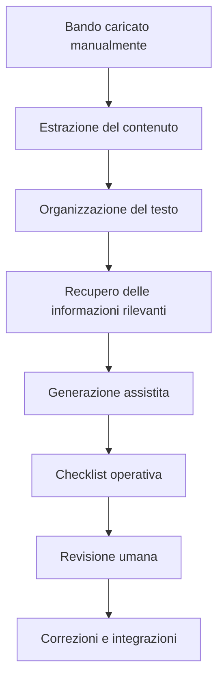

# Architettura funzionale del sistema

## 1. Problema affrontato

La partecipazione a un bando richiede la lettura di documenti lunghi, spesso complessi e ricchi di vincoli formali. Un'azienda deve individuare requisiti, scadenze, allegati, criteri di ammissibilita' e informazioni da preparare prima di poter valutare correttamente una candidatura.

Questa attivita' e' manuale, ripetitiva e soggetta a errori, soprattutto quando le informazioni sono distribuite in piu' sezioni del documento o quando alcuni dati devono essere verificati dall'utente.

Il problema non e' quindi solo "rispondere a domande su un PDF", ma supportare una fase preliminare del processo di candidatura: comprendere il bando, organizzare le informazioni rilevanti e produrre un output operativo controllabile.

## 2. Obiettivo della soluzione

L'obiettivo del sistema e' assistere l'utente nell'analisi iniziale di un bando e nella produzione di una checklist operativa revisionabile.

Il sistema non ha l'obiettivo di generare automaticamente una candidatura completa. La candidatura resta un processo che richiede valutazione umana, conoscenza aziendale e controllo finale.

L'obiettivo del primo prototipo e' piu' circoscritto:

- acquisire manualmente un bando;
- estrarre le informazioni testuali disponibili;
- individuare requisiti, vincoli, allegati e scadenze;
- generare una checklist ordinata;
- indicare le fonti usate;
- segnalare informazioni mancanti o da verificare.

## 3. Principio progettuale

La soluzione viene progettata come pipeline di supporto alla decisione e alla preparazione della candidatura.

Il RAG non rappresenta l'intero sistema, ma un componente centrale della pipeline. Il suo ruolo e' recuperare dai documenti caricati le informazioni rilevanti e fornire un fondamento documentale alla generazione degli output.

La generazione deve quindi essere vincolata alle informazioni presenti nei documenti. Quando un dato non viene trovato, il sistema deve indicarlo come mancante o da verificare, invece di produrre una risposta non supportata.

## 4. Architettura logica

La pipeline segue un flusso semplice:

1. l'utente fornisce il bando;
2. il sistema estrae il contenuto disponibile;
3. il contenuto viene organizzato in parti consultabili;
4. il sistema recupera le parti piu' rilevanti rispetto al compito richiesto;
5. viene generata una checklist basata sul contenuto recuperato;
6. l'utente revisiona, corregge e completa l'output.

## 5. Componenti funzionali

| Componente | Responsabilita' |
|---|---|
| Acquisizione documento | Permette all'utente di fornire manualmente il bando da analizzare |
| Estrazione contenuto | Ricava il testo disponibile dal documento |
| Organizzazione informativa | Suddivide il contenuto in parti gestibili e mantiene riferimenti al documento |
| Recupero contestuale | Seleziona le parti del bando rilevanti per una domanda o per la checklist |
| Generazione assistita | Produce un output leggibile a partire dalle informazioni recuperate |
| Revisione umana | Permette all'utente di validare, correggere e integrare il risultato |

## 6. Primo caso d'uso

Il primo caso d'uso scelto e' l'analisi preliminare di un bando e la generazione di una checklist operativa per la candidatura.

Questo caso d'uso e' adatto a un MVP perche':

- e' circoscritto;
- produce un risultato concreto e valutabile;
- non richiede di automatizzare l'intera candidatura;
- valorizza il recupero di informazioni dal documento;
- rende esplicita la necessita' di revisione umana;
- consente di evidenziare informazioni mancanti o ambigue.

## 7. Output previsto

La checklist prodotta dal sistema deve essere organizzata in sezioni comprensibili:

- requisiti principali;
- documenti e allegati richiesti;
- scadenze;
- vincoli e criteri di ammissibilita';
- informazioni aziendali necessarie;
- informazioni mancanti o da verificare;
- note per la revisione umana.

Ogni elemento, quando possibile, deve riportare un riferimento al documento di origine, ad esempio pagina, sezione o fonte.

## 8. Scope del prototipo

### Incluso

- caricamento o selezione manuale di un bando;
- estrazione del testo dal documento;
- interrogazione del bando;
- generazione di una checklist revisionabile;
- visualizzazione delle fonti disponibili;
- segnalazione di informazioni mancanti.

### Escluso

- ricerca automatica dei bandi online;
- scraping di siti istituzionali;
- gestione completa di piu' bandi contemporaneamente;
- generazione automatica della candidatura finale;
- compilazione automatica degli allegati;
- integrazione con sistemi aziendali reali;
- workflow complessi basati su agenti.

## 9. Ruolo della revisione umana

La revisione umana e' parte integrante dell'architettura.

Il sistema non sostituisce l'utente nella valutazione del bando, ma lo supporta nella raccolta e nell'organizzazione delle informazioni. L'utente deve poter controllare le fonti, correggere eventuali errori, integrare dati mancanti e decidere se procedere con la candidatura.

Questa scelta rende il prototipo piu' realistico e difendibile: il sistema produce un supporto operativo, non una decisione automatica.

## 10. Criteri di valutazione

Il prototipo puo' essere valutato osservando:

- se la checklist contiene le informazioni principali del bando;
- se gli elementi prodotti sono collegati a fonti verificabili;
- se il sistema evita di inventare informazioni non presenti;
- se le informazioni mancanti vengono segnalate chiaramente;
- se l'output e' utile come base per una revisione umana;
- se il flusso e' semplice da spiegare e riprodurre.

## 11. Evoluzioni successive

Dopo il primo MVP, il sistema potrebbe essere esteso per:

- confrontare il bando con un profilo aziendale strutturato;
- verificare automaticamente alcuni requisiti di ammissibilita';
- gestire piu' documenti e allegati;
- produrre bozze parziali di sezioni della candidatura;
- esportare gli output in formati adatti alla revisione;
- integrare dati aziendali reali.

## 12. Sintesi

Il prototipo riusa una semplice interfaccia conversazionale per validare il primo caso d'uso della nuova architettura: analisi preliminare di un bando e generazione di una checklist revisionabile.

Il RAG non e' la soluzione completa, ma il componente di recupero e grounding che alimenta la generazione assistita degli output. La soluzione complessiva resta orientata al supporto del processo di candidatura, con revisione umana esplicita e gestione delle informazioni mancanti.
